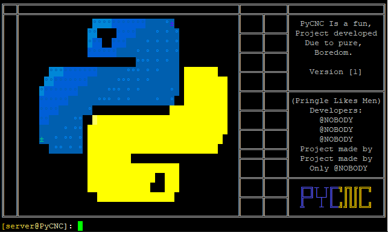

# PyCNC
PyCNC Is a extremely customizable cnc made in python it is closed source for now but it will release at somepoint!
- ill be adding custom commands here, Make sure to check back every once in a while!
  - help: Sends the help banner
  - clients: shows current client count ADMIN
  - test: grabs the plan of the user sent (arg 1)
  - methods: Shows method list
# WARNING
# SatsujinC2 Will be releasing soon 
If the screen terminates run ./CNC and check if you have python3-pip installed and run pip3 install <module here>
Contact me if you need help setting it up
# How to use cnc (pref ubuntu 22):
sh start.sh
# Image(s)

# Coming soon
- [ ] Better command documentation/Custom command generator cli
- [ ] Updater like system
- [ ] Custom title
- [ ] API Funneling options
- [ ] Better plan/expiry system
- [ ] Discord webhook logs
- [ ] Anti-Brute
- [ ] IP Banning
- [ ] Multi API Handler
- [ ] Authenticator (2FA)
- [ ] Fading functions
# New cnc features
- [X] Fading functions
- [X] Bots + Apis (With funneling too)
- [X] Ip banning and acccount banning
- [X] Good account system(Expiry,Plan etc.)
- [X] Discord logs
- [X] Anti-Brute
- [X] Super low resource requirement(Usually 0% cpu, .40% ram)
- [X] Licensing system
- [X] Api funneling + Multi api support
- +So much more
- Please add suggestions!
